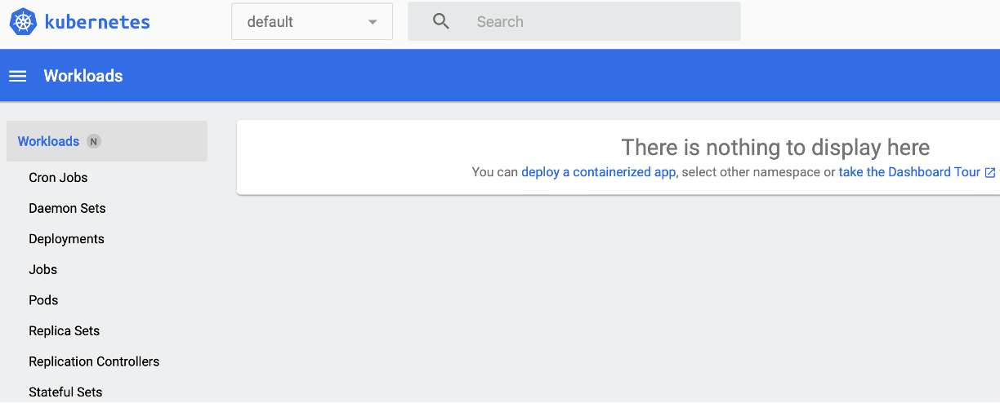
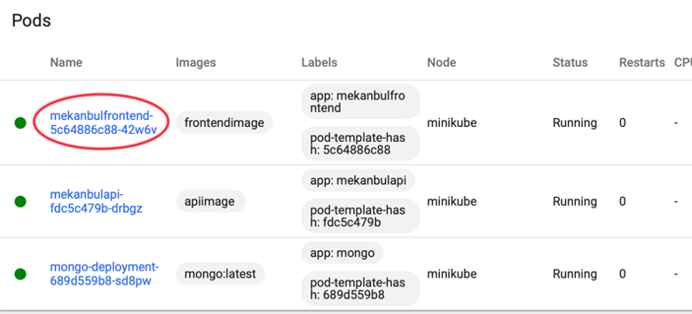
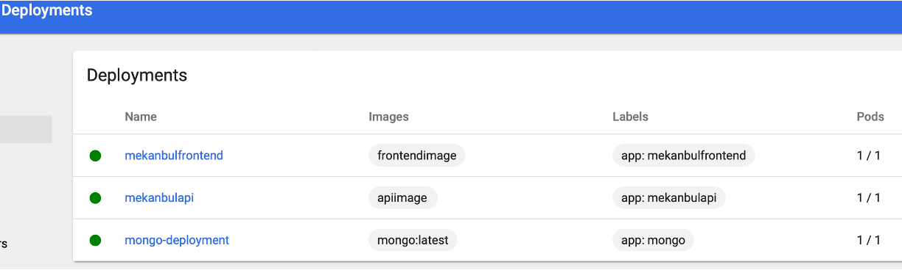
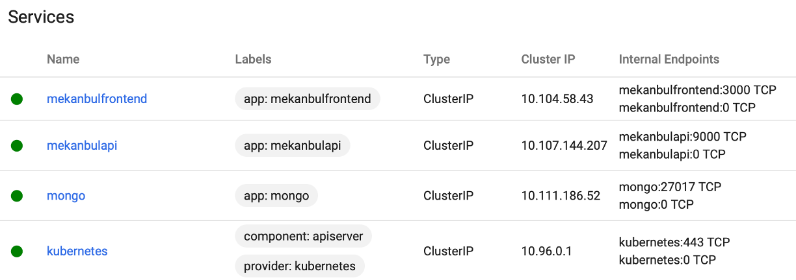

# Docker-Compose İle Çalıştırma
* REST API servisini kullanırken adres http://servisadi:port şeklinde koddan değiştirilmeli. servisadi ve port yaml dosyasında tanımlanan ad ve porttur.
* Aynı şekilde MongoDB bağlantı adresiniz mongodb://mongodbservisadi:port/veritabaniadi şeklinde olmalı.
1. VSCode ile uygulama klasörünü açın.
2. Terminalde docker-compose build komutunu çalıştırın.
3. Terminalde docker-compose up komutunu çalıştırın.

# Kubernete İle Çalıştırma
* Kubectl yükleyin: https://kubernetes.io/docs/tasks/tools/
* Minikube yükleyin: https://minikube.sigs.k8s.io/docs/start/
* minikube start komutu ile minikube’ü çalıştırın.
* Ayrı bir komut satırında minikube dashboard komutu ile minikube web arayüzünü çalıştırın.
* Karşınıza aşağıdaki gibi bir ekran çıkacaktır.

* Uygulamayı VSCode ile açın ve uygulama içindeyken terminal ekranında aşağıdaki komutu çalıştırın ve minikube ortamına geçişi sağlayın.
    * eval $(minikube docker-env)
* İmajları ve servisleri sırayla aşağıdaki komutlarla oluşturun.

# MongoDB Deployment
* İmaj oluşturma: docker build –t mongo .
* Pod Deployment: kubectl apply -f mongo-deployment.yaml
* Servis Oluşturma: kubectl apply -f mongo-service.yaml

# Backend (Mekanbul API) Deployment
* cd mekanbul_api
* İmaj oluşturma: docker build –t apiimage .
* cd ..
* Pod Deployment: kubectl apply -f  mekanbulapi-deployment.yaml
* Servis Oluşturma: kubectl apply -f mekanbulapi-service.yaml

# Frontend Deployment
* mekanbul_api klasöründe iseniz cd .. ile bir üste çıkın.
* İmaj oluşturma: docker build –t frontendimage .
* Pod Deployment: kubectl apply -f mekanbulfrontend-deployment.yaml
* Servis Oluşturma: kubectl apply -f mekanbulfrontend-service.yaml

Kubernete’e gönderdiğiniz uygulama dışardan erişime açık değildir. Kendi içinde IP almış durumdadır. Dışarıdaki trafiği kubernete’e yönlendirmek ve uygulamanızı test etmek için aşağıdaki işlemi yapmanız gerekir.
* kubectl port-forward mekanbulfrontendpodismi 3000:3000
Pod ismi aşağıda işaretlenmiş isimdir. mekanbulfrontend-5c64886c88-42w6v. Bu isim sizde farklı olacaktır.

Deployment ve servislerinizi minikube dashboard aracılığı ile görebilirsiniz.

